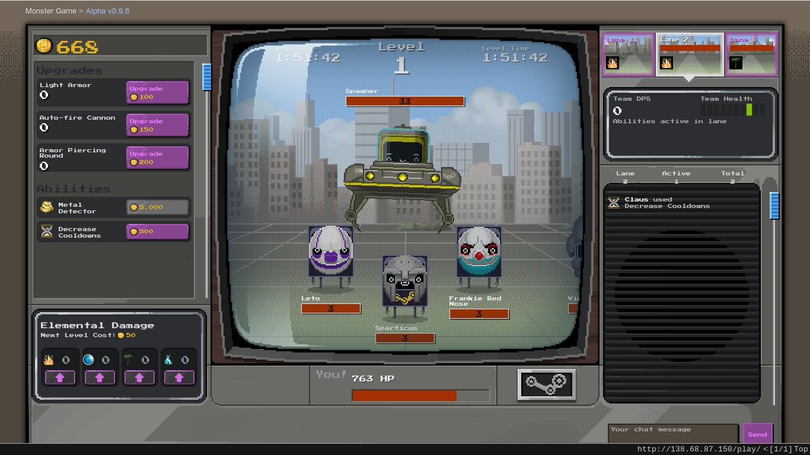
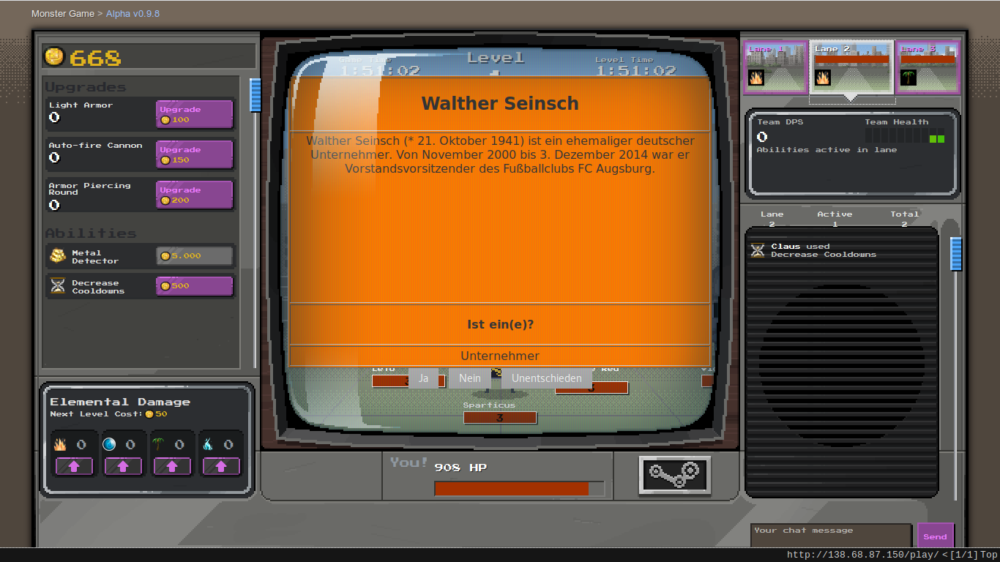
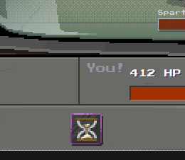

# Verilinks: Crowd Sourcing Link Evaluation

This in an adpation of the popular browser game [Monster Minigame aka Tower Attack](https://github.com/SteamDatabase/MonsterMinigame) which includes simple tasks with  yes/no/don't know answer options.
The rules are very simple: Attack and defeat monsters for gold by clicking them (fast), buy upgrades and thus become an even more efficient monster slayer.
In short, our goal is to study the extent to which crowd-sourcing tasks in the context of a Web game is suitable for aquiring quality solutions.

Just enter your user name and start playing; but in order to help us with our evaluation we have two simple requests:

* Due to ease of access there is no registration, so please choose a somewhat discriminative username in order to avoid name clashes. For example, use Bob82 instead of just Bob.
* Please avoid playing under multiple user names and instead rather stick to one.

Upon entering your user name, the mode in which you will be prompted for tasks will be chosen at random:

* Timed mode: Tasks will appear at random time intervals

* Ability mode: Tasks will appear at ability _activation_ - Note that you need to buy abilities before you can activate them!

## Ok, enough text, let me play!

[Click here to play!](http://138.68.87.150/)

